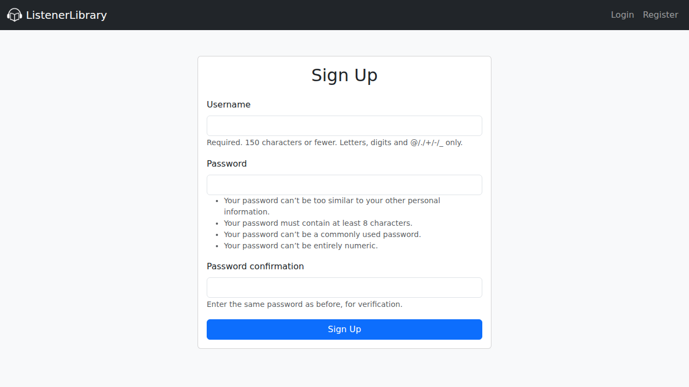
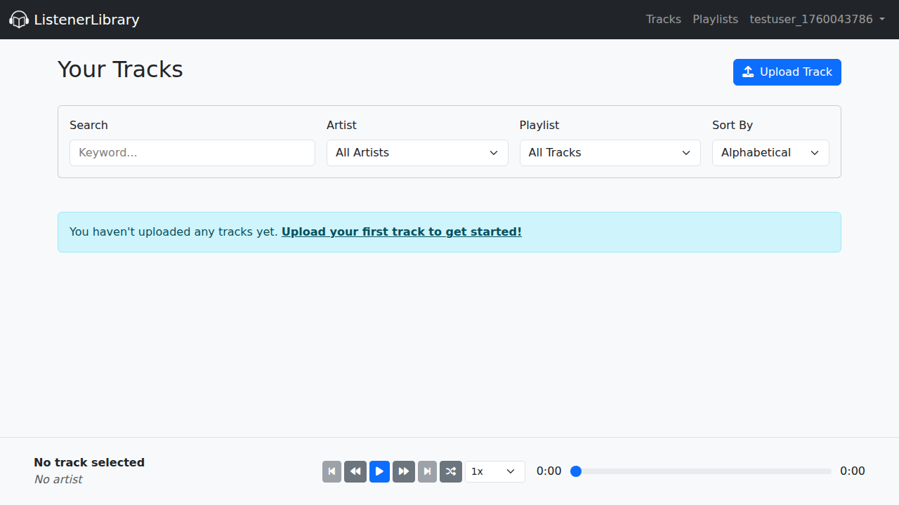
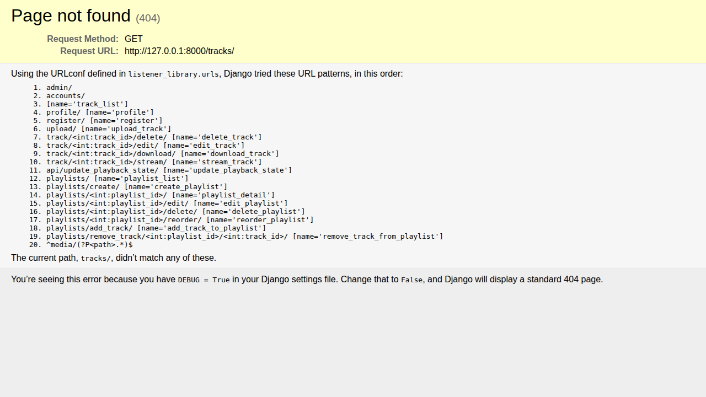
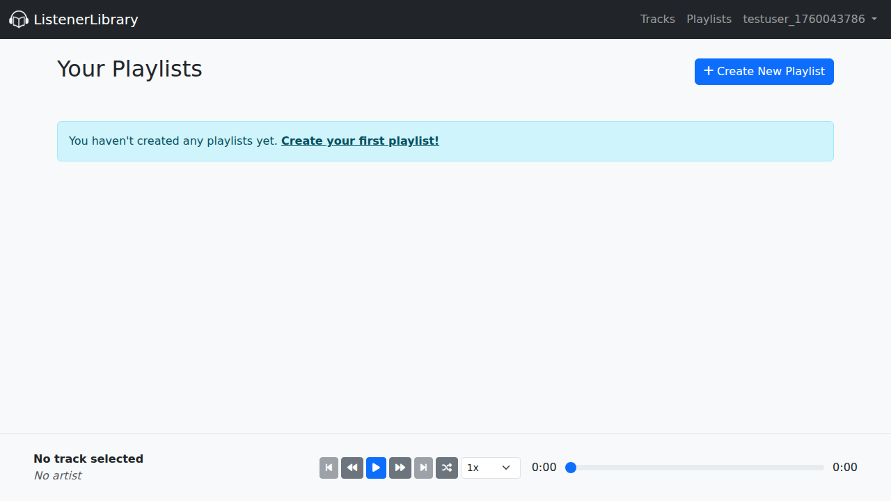

# ListenerLibrary

  

ListenerLibrary is a web-based music player application built with Django. It allows users to upload their music, create playlists, and listen to their tracks directly in the browser. The application features a clean, responsive interface and provides core music player functionalities like playback control, track seeking, and playlist management.

## Features

*   **Secure User Authentication:** Users can sign up, log in, and log out to manage their personal music library.
*   **Music Upload:** Upload audio files (eg. MP3, WAV). The application automatically extracts metadata like title, artist, and duration.
*   **Playlist Management:** Create, rename, and delete playlists. Add or remove tracks from any playlist.
*   **Drag-and-Drop Reordering:** Easily reorder tracks within a playlist using a drag-and-drop interface.
*   **Audio Playback:** A persistent audio player that allows for continuous playback while navigating the site.
*   **Mobile-Friendly:** Responsive design that works on both desktop and mobile devices.
*   **Lock Screen Controls:** Control media playback from the device's lock screen on mobile.
*   **Color Themes:** Switch between light and dark themes for a personalized experience.

## Getting Started

To get a local copy up and running, follow these simple steps.

### Prerequisites

*   Python 3.8+
*   `pip`
*   `ffmpeg` (for audio processing)

### Installation

1.  **Clone the repository:**
    ```sh
    git clone https://github.com/your_username/ListenerLibrary.git
    cd ListenerLibrary
    ```

2.  **Install Python dependencies:**
    ```sh
    pip install -r requirements.txt
    ```

3.  **Install system dependencies (e.g., on Debian/Ubuntu):**
    ```sh
    sudo apt-get update
    sudo apt-get install -y ffmpeg
    ```

4.  **Apply database migrations:**
    ```sh
    python manage.py migrate
    ```

5.  **Run the development server:**
    ```sh
    python manage.py runserver
    ```

    The application will be available at `http://127.0.0.1:8000/`.

## Screenshots

### Registration Page


### Home Page (Track List)


### All Tracks Page


### Playlists Page
