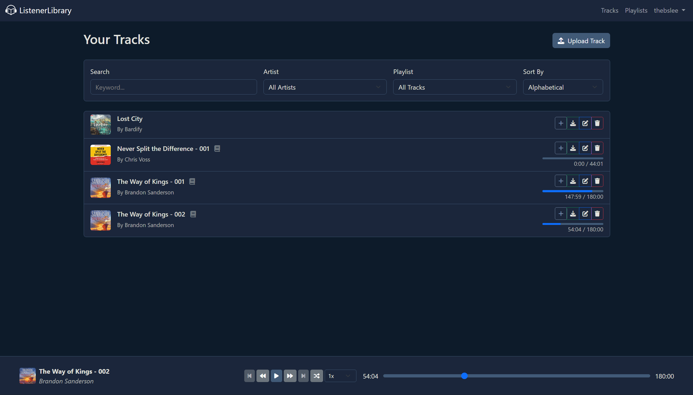
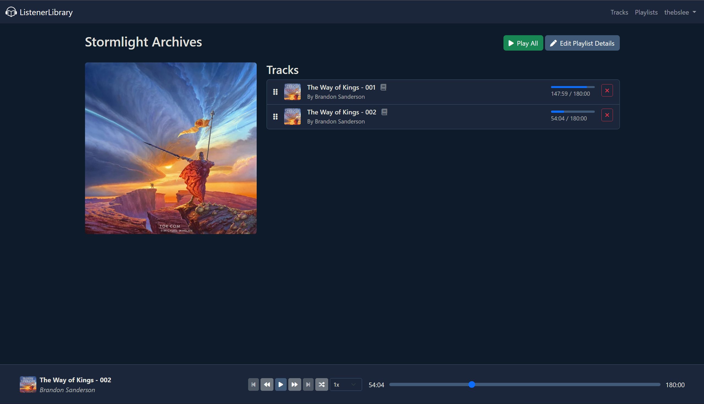
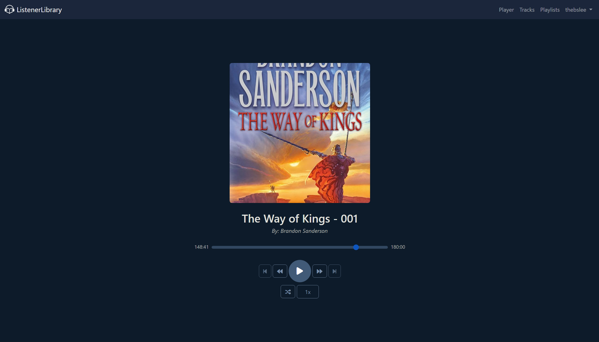

# ListenerLibrary

  

ListenerLibrary is a mobile-friendly, web-based music player application built with Django. It allows users to upload their music, create playlists, and listen to their tracks directly in the browser. The application features a clean, responsive interface and provides core music player functionalities like playback control, track seeking, and playlist management.

## Key Features

*   **Music Upload:** Upload audio files (eg. MP3, WAV). The application automatically extracts metadata like title, artist, and duration.
*   **Playlist Management:** Create, rename, and delete playlists. Add or remove tracks from any playlist. Easily reorder tracks within a playlist using a drag-and-drop interface.
*   **Audio Playback:** A persistent audio player that allows for continuous playback while navigating the site. Able to differentiate tracks between "Podcast" type and "Song" type, with the player keeping track of where you left off for the former.

## Screenshots
Tracks List:

Playlist view:

Focused view:
